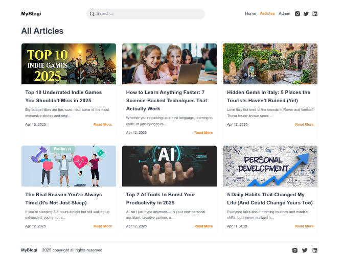
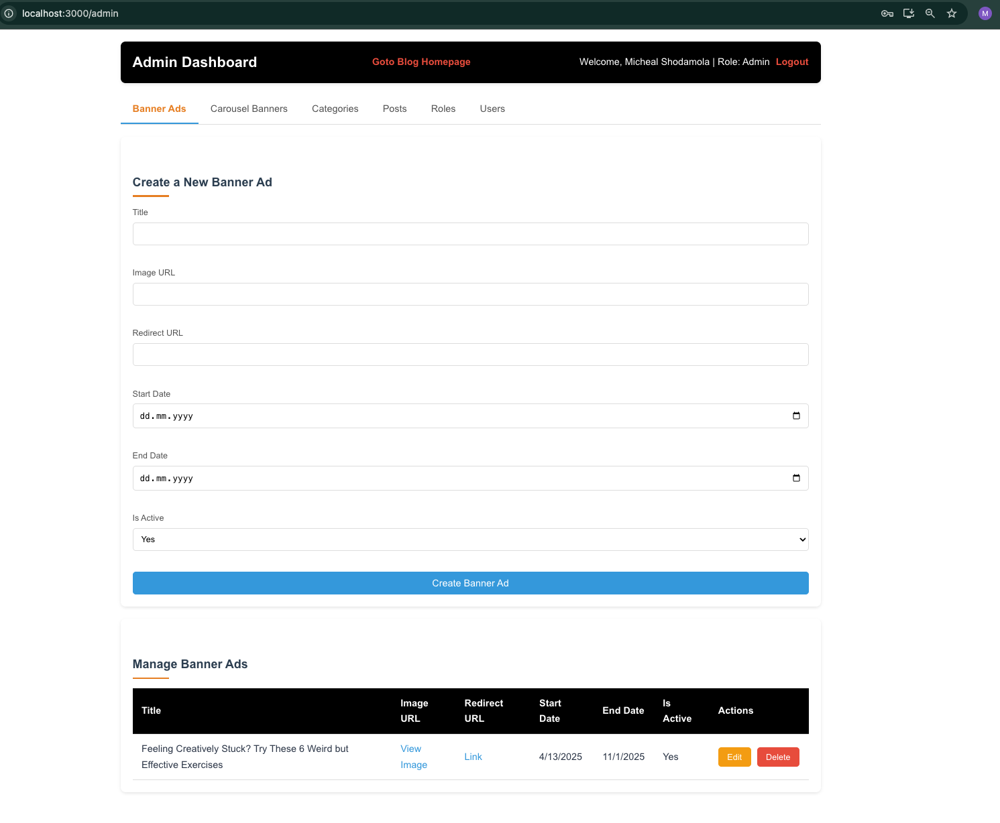

# Phase 4 – Project Presentation

## 🎯 Project Title

**MyBlogi: A Modern Blogging Platform**

---

## 📝 Project Overview

**MyBlogi** is a full-stack web application designed to provide a seamless blogging experience for both readers and administrators. The platform allows users to browse articles, view featured content, and engage with promotions, while administrators can manage blog content through a secure dashboard. The project targets bloggers, content creators, and readers looking for an easy and visually appealing platform. It was developed to showcase a solid integration of a React frontend with a .NET backend API, emphasizing modularity, scalability, and user-friendly design.

The application consists of:
- A **React-based frontend** for the public-facing website and admin dashboard.
- A **.NET 9.0 backend API** with PostgreSQL for data management, built using the Chain of Responsibility pattern.
- **JWT-based authentication** for secure admin access.

---

## 📌 Use Case Summary

The use cases were defined in Phase 1 and implemented as follows:

| Use Case | Implemented (Yes/No) | Demonstration / Notes |
|----------|----------------------|------------------------|
| User browses the homepage | Yes | Displays carousel banners, featured posts, and promotions. |
| User views all articles | Yes | Grid layout with “Read More” links. |
| User reads a specific article | Yes | Full post content with images and metadata.  |
| Admin logs in | Yes | JWT-based authentication with token storage.  |
| Admin manages posts (CRUD) | Yes | Create, update, delete posts via dashboard. |
| Admin manages categories (CRUD) | Yes | Organize posts into categories.|
| Admin manages banner ads (CRUD) | Yes | Schedule and activate ads. |
| Admin manages carousel banners (CRUD) | Yes | Control display order and activation. |
| Admin manages users and roles (CRUD) | Yes | Role-based access control. |
| User searches for articles | No | Planned but not implemented due to time constraints. Possible future work. |

---

## ✍️ Technical Implementation

### Frontend (React)
- **Technologies**: React, React Router, Axios, React Slick, JWT-decode.
- **Architecture**:
  - Component-based structure with reusable UI elements (e.g., carousels, skeleton loaders).
  - React Router for client-side navigation (e.g., `/`, `/articles`, `/admin` , `etc`).
  - Axios for API communication with the backend at `http://localhost:5115`.
  - JWT-based authentication with tokens stored in `localStorage`.
- **Key Features**:
  - **Homepage**: Displays dynamic carousel banners, featured posts, and promotions using React Slick.
  - **Articles Page**: Grid layout with pagination and “Read More” links, optimized with memo for performance.
  - **Post Page**: Renders full article content with responsive design.
  - **Admin Dashboard**: Tabbed interface for managing posts, categories, ads, banners, users, and roles, with delete confirmations and skeleton loaders for better UX.
  - **Responsive Design**: Mobile-friendly layout using CSS media queries.

### Backend (.NET 9.0 API)
- **Technologies**: .NET 9.0, ASP.NET Core, PostgreSQL, Dapper, Npgsql, Swagger.
- **Architecture**:
  - **Chain of Responsibility** pattern for modular request handling, splitting logic into controllers, orchestrators, handlers, services, and repositories.
  - **Dependency Injection** for service management.
  - **Dapper** for lightweight, efficient database operations via stored procedures.
  - **PostgreSQL** for relational data storage with a schema including users, roles, categories, posts, banner ads, and carousel banners.
- **Key Features**:
  - **RESTful Endpoints**: CRUD operations for all entities (e.g., `/CreatePost`, `/GetAllUsers`).
  - **JWT Authentication**: Secures all endpoints except `/Login`.
  - **Stored Procedures**: Encapsulate database logic for maintainability (e.g., `create_user`, `get_all_posts`).
  - **Swagger UI**: Provides interactive API documentation and testing.

### Integration
- The frontend communicates with the backend via Axios, using a configurable `API_BASE_URL` (`http://localhost:5115` by default).
- JWT tokens are passed in the `Authorization` header for admin requests.
- The backend enforces role-based access, ensuring only authorized users can perform CRUD operations.

### Screenshots
#### Frontend
- **Homepage**  
  
- **Articles Page**  
  
- **Post Page**  
  
- **Admin Dashboard**  
  

#### Backend
- **Swagger Endpoints**  
  
- **Schemas**  
  

---

## 🚂 Development Process

1. **Phase 1 (Planning)**:
   - Defined use cases and created wireframes for the frontend.
   - Designed the database schema and stored procedures for the backend.
   - Decided on React for the frontend and .NET 9.0 with PostgreSQL for the backend.

2. **Phase 2 (Development)**:
   ***(Backend Development)***:
   - Set up the .NET API project with the Chain of Responsibility pattern.
   - Implemented core endpoints (e.g., `/Login`, `/CreatePost`) and tested with Swagger.
   - Configured PostgreSQL and Dapper for data access.
   - Faced challenges with stored procedure debugging, resolved by simplifying query logic.

   ***(Frontend Development)***:
   - Built the React app with a modular folder structure (`pages/`, `components/`).
   - Implemented the homepage, articles, and post pages with responsive design.
   - Added the admin dashboard with CRUD functionality and JWT authentication.
   - Encountered issues with React Slick carousel styling, fixed by customizing CSS.

3. **Phase 4 (Integration and Testing)**:
   - Connected the frontend to the backend via Axios.
   - Tested authentication and CRUD operations end-to-end.
   - Optimized performance with memo and skeleton loaders.
   - Decided against implementing search functionality due to time constraints.

4. **Phase 4 (Documentation and Presentation)**:
   - Wrote detailed READMEs for both frontend and backend.
   - Created this presentation with screenshots.
   - Reflected on challenges and future improvements.

---

## ☀️ Reflection and Future Work

### What Worked Well
- **Modular Architecture**: The Chain of Responsibility pattern made the backend extensible and easy to maintain.
- **Responsive Design**: The frontend’s mobile-friendly UI was well-received in testing.
- **JWT Authentication**: Secure and seamless admin access was achieved.
- **Documentation**: Swagger and READMEs provided clear guidance for developers.

### Challenges
- **Stored Procedures and Functions**: Debugging complex PostgreSQL stored procedures functions was time-consuming, especially for cascading deletes.
- **Carousel Styling**: React Slick required custom CSS overrides, which was initially tricky.
- **Time Constraints**: The search functionality was deprioritized, limiting user experience.

### Future Work
- **Search Functionality**: Filter articles by keyword or category.
- **Comment System**: Allow users to comment on posts, with moderation tools for admins.
- **Performance Optimization**: Implement server-side rendering for the frontend to improve load times.
- **Analytics Dashboard**: Provide admins with insights into user engagement and ad performance.

---

## 📊 Work Hours Log

| Date       | Time | Task                                |
|------------|------|-------------------------------------|
| 1.4.2025   | 3h   | Defined use cases and wireframes    |
| 1.4.2025   | 10h   | Set up .NET API and PostgreSQL      |
| 4.4.2025   | 18h   | Implemented backend CRUD endpoints  |
| 5.4.2025   | 16h   | Configured JWT authentication       |
| 7.4.2025  | 8h   | Built React homepage and articles   |
| 8.4.2025  | 7h   | Developed admin dashboard           |
| 9.4.2025  | 4h   | Integrated frontend and backend     |
| 11.4.2025  | 3h   | Added skeleton loaders and styling  |
| 12.4.2025  | 8h   | Tested and debugged end-to-end      |
| 13.4.2025  | 3h   | Wrote READMEs and documentation     |
| 25.4.2025  | 5h   | Created presentation README |
| **Total**  | **85h** |                                 |

---

## 🪢 Presentation Link
 
This project will be presented live in the class.
